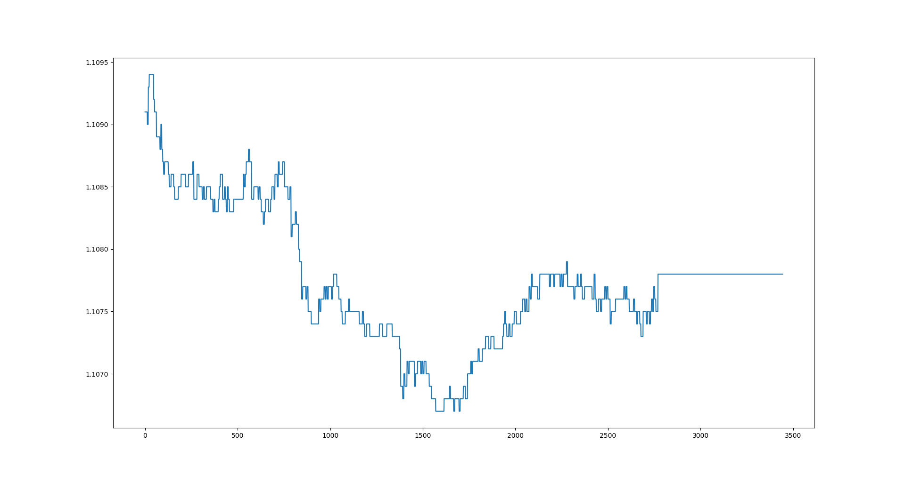

# Forex Data Collector
Python script to collect data from [fcsapi.com](https://fcsapi.com) and display with [Matplotlib.](https://pypi.org/project/matplotlib/)
You can use this base to build your project. For example, you can use it to develop a program with neural networks to predict the price, as in this [repo](https://github.com/eliastheis/time-series-prediction).
At[fcsapi.com](https://fcsapi.com) you can create your free API key.

## Demo
Here you can see what the program produces. You can ignore the straight line at the end. It came about because the market was closed.
